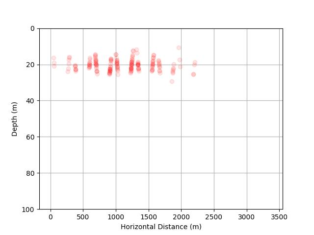

# Image Based Targeted Sampling Simulation

## Overview
Python scripts to simulate an imaging system sampling particle fields and returning counts of detected objects.

## Requirements

- numpy
- scipy

## Running the simulator

`python sim.py`

## Current output

Simulates a background field of objects and a patch of high density objects. Drives the AUV through the patch doing yoyos and plots the counts vs depth and time where count/10 controls the marker opacity.

 

# TODO (a lot)

- Convert auv into component and add 3D lat/lon/depth input
- Add better data output and plotting tools
- Review count data to check for consistency with field data
